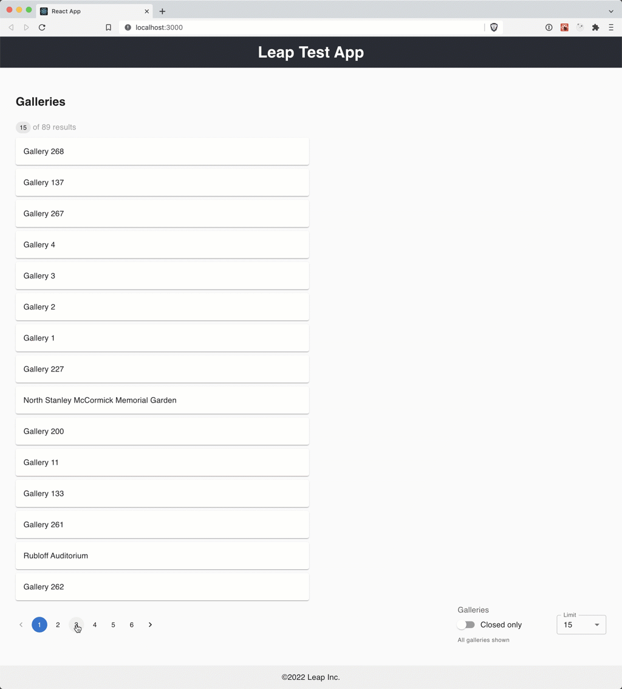

# *Leap, Inc.* React Technical Interview

[](http://commitizen.github.io/cz-cli/)

In this interview we're going to use some React fundamentals to retrieve a list of galleries from the Art Institute of Chicago's API and formatting the results.

You'll find some high level user stories below that your interviewer will review with you. Feel free to ask questions and clarify the stories as you would in a working situation.



Feel free to use whatever resources you would in your normal day to day including web search etc.

## Resources

* [Art Institute of Chicago Public API](https://api.artic.edu/docs/)

## Requirements

* Node/Yarn

## Installation

```
$ yarn
```

## Usage

This repo was bootstrapped with [Create React App](https://create-react-app.dev/).

In the project directory, run—

```
$ yarn start
````

Then open [http://localhost:3000](http://localhost:3000) to view it in browser (in dev mode).

## Instructions

Below you will find stories for creating a React app using the Art Institute of Chicago's API.

### Retrieves a list of Galleries from the Art Institute of Chicago's API and render it in the test app

> As a User \
> I want to be presented with a list of galleries \
> So I can browse the contents of each

The list should—
* include the value from `title` property,
* return a list of available galleries ([API docs](https://api.artic.edu/docs/#galleries)),
* provide the ability retrieve paginated results, and
* provide the ability to show different size pages based on `limit`.

### Remove galleries from list where `is_closed` is true

> As a User \
> In order to avoid false positives \
> I should only see galleries where `is_closed` is false
